# Student Management System

## Giới thiệu

Hệ thống Quản lý Sinh viên là phần mềm giúp quản lý thông tin sinh viên một cách hiệu quả. Dự án được phát triển với TypeScript và quản lý theo kiến trúc monorepo sử dụng Turborepo.

## Cấu trúc source code

```
📦                          // Thư mục gốc của dự án
├─ .gitignore               // Tệp cấu hình cho Git: liệt kê các tệp/thư mục cần bỏ qua
├─ .npmrc                   // Tệp cấu hình cho npm
├─ .vscode                  // Thư mục cấu hình cho Visual Studio Code
│  └─ settings.json         // Cài đặt cá nhân của dự án trong VS Code
├─ README.md                // Tệp hướng dẫn sử dụng, thông tin dự án
├─ apps                     // Thư mục chứa các ứng dụng con của dự án
│  ├─ api                   // Ứng dụng API (Backend)
│  │  ├─ .env.example       // Mẫu tệp biến môi trường (environment variables)
│  │  ├─ .gitignore         // Tệp Git ignore riêng cho ứng dụng API
│  │  ├─ .prettierrc        // Cấu hình định dạng mã nguồn với Prettier
│  │  ├─ README.md          // Hướng dẫn sử dụng cho ứng dụng API
│  │  ├─ docker-compose.yml // Cấu hình Docker Compose cho API
│  │  ├─ eslint.config.mjs  // Cấu hình ESLint cho dự án API
│  │  ├─ nest-cli.json      // Cấu hình cho NestJS CLI
│  │  ├─ package.json       // Danh sách phụ thuộc và lệnh chạy cho API
│  │  ├─ prisma             // Thư mục chứa cấu hình và schema cho Prisma ORM
│  │  │  └─ schema.prisma   // Tệp định nghĩa schema cho cơ sở dữ liệu qua Prisma
│  │  ├─ src                // Thư mục mã nguồn chính của API
│  │  │  ├─ app.controller.spec.ts   // Tệp kiểm thử cho controller của app
│  │  │  ├─ app.controller.ts        // Controller chính của ứng dụng
│  │  │  ├─ app.module.ts            // Module gốc của ứng dụng NestJS
│  │  │  ├─ app.service.ts           // Service chính của ứng dụng
│  │  │  ├─ config                   // Thư mục chứa các cấu hình chung của API
│  │  │  │  └─ business-rules.config.ts  // Cấu hình các quy tắc nghiệp vụ
│  │  │  ├─ main.ts                  // Tệp khởi chạy ứng dụng
│  │  │  ├─ modules                  // Thư mục chứa các module chức năng của API
│  │  │  │  ├─ addresses             // Module quản lý địa chỉ
│  │  │  │  │  ├─ adapters            // Các lớp chuyển đổi giữa domain và các thành phần bên ngoài
│  │  │  │  │  │  ├─ driven           // Các lớp chịu trách nhiệm thực hiện các tác vụ từ bên ngoài (ví dụ: truy cập CSDL)
│  │  │  │  │  │  │  └─ addresses.repository.ts  // Repository cho chức năng địa chỉ
│  │  │  │  │  │  └─ driver           // Các lớp điều khiển đầu vào (controllers)
│  │  │  │  │  │     ├─ addresses.controller.spec.ts  // Kiểm thử cho addresses controller
│  │  │  │  │  │     └─ addresses.controller.ts       // Controller xử lý yêu cầu liên quan đến địa chỉ
│  │  │  │  │  ├─ addresses.module.ts  // Module định nghĩa và cấu hình cho addresses
│  │  │  │  │  └─ domain             // Lớp miền (domain) của module addresses
│  │  │  │  │     ├─ dto            // Các đối tượng truyền dữ liệu cho addresses
│  │  │  │  │     │  ├─ addresses.dto.ts        // DTO tổng quát cho địa chỉ
│  │  │  │  │     │  ├─ create-address.dto.ts   // DTO khi tạo địa chỉ mới
│  │  │  │  │     │  └─ update-address.dto.ts   // DTO khi cập nhật địa chỉ
│  │  │  │  │     └─ port           // Các cổng giao tiếp của module
│  │  │  │  │           ├─ input    // Giao diện cho các dịch vụ nhận đầu vào
│  │  │  │  │           │  ├─ IAddressesService.ts     // Interface cho service địa chỉ
│  │  │  │  │           │  ├─ addresses.service.spec.ts  // Kiểm thử cho service địa chỉ
│  │  │  │  │           │  └─ addresses.service.ts       // Service xử lý nghiệp vụ địa chỉ
│  │  │  │  │           └─ output   // Giao diện cho các repository đầu ra
│  │  │  │  │                └─ IAddressesRepository.ts  // Interface cho repository địa chỉ
│  │  │  │  ├─ faculties           // Module quản lý khoa
│  │  │  │  │  ├─ adapters          // Các lớp chuyển đổi cho module khoa
│  │  │  │  │  │  ├─ driven         // Lớp chịu trách nhiệm thao tác dữ liệu từ bên ngoài
│  │  │  │  │  │  │  └─ faculties.repository.ts  // Repository cho khoa
│  │  │  │  │  │  └─ driver         // Lớp điều khiển đầu vào cho khoa
│  │  │  │  │  │     ├─ faculties.controller.spec.ts  // Kiểm thử cho controller khoa
│  │  │  │  │  │     └─ faculties.controller.ts       // Controller cho module khoa
│  │  │  │  │  ├─ domain             // Lớp miền của module khoa
│  │  │  │  │  │  ├─ dto            // Các DTO cho khoa
│  │  │  │  │  │  │  ├─ create-faculty.dto.ts   // DTO tạo khoa mới
│  │  │  │  │  │  │  ├─ faculties.dto.ts        // DTO tổng quát cho khoa
│  │  │  │  │  │  │  └─ update-faculty.dto.ts   // DTO cập nhật thông tin khoa
│  │  │  │  │  │  └─ port           // Các cổng giao tiếp của module khoa
│  │  │  │  │  │     ├─ input        // Giao diện input cho khoa
│  │  │  │  │  │     │  ├─ IFaculitiesService.ts  // Interface cho service khoa
│  │  │  │  │  │     │  ├─ faculties.service.spec.ts  // Kiểm thử cho service khoa
│  │  │  │  │  │     │  └─ faculties.service.ts       // Service xử lý nghiệp vụ khoa
│  │  │  │  │  │     └─ output       // Giao diện output cho khoa
│  │  │  │  │  │        └─ IFacultiesRepository.ts  // Interface cho repository khoa
│  │  │  │  │  └─ faculties.module.ts  // Module định nghĩa và cấu hình cho khoa
│  │  │  │  ├─ identity-papers     // Module quản lý giấy tờ tùy thân
│  │  │  │  │  ├─ adapters          // Các lớp chuyển đổi cho module giấy tờ
│  │  │  │  │  │  ├─ driven         // Lớp thao tác dữ liệu bên ngoài cho giấy tờ
│  │  │  │  │  │  │  └─ identity-papers.repository.ts  // Repository cho giấy tờ
│  │  │  │  │  │  └─ driver         // Lớp điều khiển đầu vào cho giấy tờ
│  │  │  │  │  │     ├─ identity-papers.controller.spec.ts  // Kiểm thử cho controller giấy tờ
│  │  │  │  │  │     └─ identity-papers.controller.ts       // Controller xử lý yêu cầu giấy tờ
│  │  │  │  │  ├─ domain             // Lớp miền của module giấy tờ
│  │  │  │  │  │  ├─ dto            // Các DTO cho giấy tờ
│  │  │  │  │  │  │  ├─ create-identity-paper.dto.ts  // DTO tạo mới giấy tờ
│  │  │  │  │  │  │  ├─ identity-papers.dto.ts       // DTO tổng quát cho giấy tờ
│  │  │  │  │  │  │  └─ update-identity-paper.dto.ts  // DTO cập nhật giấy tờ
│  │  │  │  │  │  └─ port           // Các cổng giao tiếp của module giấy tờ
│  │  │  │  │  │     ├─ input        // Giao diện input cho giấy tờ
│  │  │  │  │  │     │  ├─ IIdentityPapersService.ts   // Interface cho service giấy tờ
│  │  │  │  │  │     │  ├─ identity-papers.service.spec.ts  // Kiểm thử cho service giấy tờ
│  │  │  │  │  │     │  └─ identity-papers.service.ts       // Service xử lý nghiệp vụ giấy tờ
│  │  │  │  │  │     └─ output       // Giao diện output cho giấy tờ
│  │  │  │  │  │        └─ IIdentityPapersRepository.ts  // Interface cho repository giấy tờ
│  │  │  │  │  └─ identity-papers.module.ts  // Module định nghĩa cho giấy tờ tùy thân
│  │  │  │  ├─ programs              // Module quản lý chương trình đào tạo
│  │  │  │  │  ├─ adapters           // Các lớp chuyển đổi cho module chương trình
│  │  │  │  │  │  ├─ driven          // Lớp thao tác dữ liệu bên ngoài cho chương trình
│  │  │  │  │  │  │  └─ programs.repository.ts  // Repository cho chương trình
│  │  │  │  │  │  └─ driver          // Lớp điều khiển đầu vào cho chương trình
│  │  │  │  │  │     ├─ programs.controller.spec.ts  // Kiểm thử cho controller chương trình
│  │  │  │  │  │     └─ programs.controller.ts       // Controller xử lý yêu cầu chương trình
│  │  │  │  │  ├─ domain             // Lớp miền của module chương trình
│  │  │  │  │  │  ├─ dto            // Các DTO cho chương trình
│  │  │  │  │  │  │  ├─ create-program.dto.ts   // DTO tạo mới chương trình
│  │  │  │  │  │  │  ├─ programs.dto.ts         // DTO tổng quát cho chương trình
│  │  │  │  │  │  │  └─ update-program.dto.ts   // DTO cập nhật chương trình
│  │  │  │  │  │  └─ port           // Các cổng giao tiếp của module chương trình
│  │  │  │  │  │     ├─ input        // Giao diện input cho chương trình
│  │  │  │  │  │     │  ├─ IProgramsService.ts    // Interface cho service chương trình
│  │  │  │  │  │     │  ├─ programs.service.spec.ts  // Kiểm thử cho service chương trình
│  │  │  │  │  │     │  └─ programs.service.ts       // Service xử lý nghiệp vụ chương trình
│  │  │  │  │  │     └─ output       // Giao diện output cho chương trình
│  │  │  │  │  │        └─ IProgramsRepository.ts  // Interface cho repository chương trình
│  │  │  │  │  └─ programs.module.ts  // Module định nghĩa cho chương trình
│  │  │  │  ├─ statuses             // Module quản lý trạng thái
│  │  │  │  │  ├─ adapters          // Các lớp chuyển đổi cho module trạng thái
│  │  │  │  │  │  ├─ driven         // Lớp thao tác dữ liệu bên ngoài cho trạng thái
│  │  │  │  │  │  │  └─ statuses.repository.ts  // Repository cho trạng thái
│  │  │  │  │  │  └─ driver         // Lớp điều khiển đầu vào cho trạng thái
│  │  │  │  │  │     ├─ statuses.controller.spec.ts  // Kiểm thử cho controller trạng thái
│  │  │  │  │  │     └─ statuses.controller.ts       // Controller xử lý yêu cầu trạng thái
│  │  │  │  │  ├─ domain             // Lớp miền của module trạng thái
│  │  │  │  │  │  ├─ dto            // Các DTO cho trạng thái
│  │  │  │  │  │  │  ├─ create-status.dto.ts    // DTO tạo mới trạng thái
│  │  │  │  │  │  │  ├─ statuses.dto.ts         // DTO tổng quát cho trạng thái
│  │  │  │  │  │  │  └─ update-status.dto.ts    // DTO cập nhật trạng thái
│  │  │  │  │  │  └─ port           // Các cổng giao tiếp của module trạng thái
│  │  │  │  │  │     ├─ input        // Giao diện input cho trạng thái
│  │  │  │  │  │     │  ├─ IStatusesService.ts   // Interface cho service trạng thái
│  │  │  │  │  │     │  ├─ statuses.service.spec.ts  // Kiểm thử cho service trạng thái
│  │  │  │  │  │     │  └─ statuses.service.ts       // Service xử lý nghiệp vụ trạng thái
│  │  │  │  │  │     └─ output       // Giao diện output cho trạng thái
│  │  │  │  │  │        └─ IStatusesRepository.ts  // Interface cho repository trạng thái
│  │  │  │  │  └─ statuses.module.ts  // Module định nghĩa cho trạng thái
│  │  │  │  └─ students             // Module quản lý sinh viên
│  │  │  │     ├─ adapters          // Các lớp chuyển đổi cho module sinh viên
│  │  │  │     │  ├─ driven         // Lớp thao tác dữ liệu bên ngoài cho sinh viên
│  │  │  │     │  │  ├─ student.repository.ts  // Repository cho sinh viên
│  │  │  │     │  │  └─ types         // Thư mục chứa các kiểu dữ liệu phụ trợ cho sinh viên
│  │  │  │     │  │     ├─ search-type.ts   // Định nghĩa kiểu tìm kiếm
│  │  │  │     │  │     └─ student-type.ts  // Định nghĩa kiểu sinh viên
│  │  │  │     │  └─ driver         // Lớp điều khiển đầu vào cho sinh viên
│  │  │  │     │     ├─ student.controller.spec.ts  // Kiểm thử cho controller sinh viên
│  │  │  │     │     └─ student.controller.ts       // Controller xử lý yêu cầu sinh viên
│  │  │  │     ├─ domain             // Lớp miền của module sinh viên
│  │  │  │     │  ├─ dto            // Các DTO cho sinh viên
│  │  │  │     │  │  ├─ address-dto.ts         // DTO cho thông tin địa chỉ của sinh viên
│  │  │  │     │  │  ├─ create-student-dto.ts  // DTO khi tạo sinh viên mới
│  │  │  │     │  │  ├─ delete-dto.ts          // DTO khi xóa sinh viên
│  │  │  │     │  │  ├─ identity-papers.dto.ts // DTO cho giấy tờ tùy thân của sinh viên
│  │  │  │     │  │  ├─ search-dto.ts          // DTO cho yêu cầu tìm kiếm sinh viên
│  │  │  │     │  │  ├─ student-dto.ts         // DTO tổng quát cho sinh viên
│  │  │  │     │  │  └─ student-response-dto.ts  // DTO phản hồi thông tin sinh viên
│  │  │  │     │  └─ port           // Các cổng giao tiếp của module sinh viên
│  │  │  │     │     ├─ input        // Giao diện input cho sinh viên
│  │  │  │     │     │  ├─ IStudentService.ts     // Interface cho service sinh viên
│  │  │  │     │     │  ├─ student.service.spec.ts  // Kiểm thử cho service sinh viên
│  │  │  │     │     │  └─ student.service.ts       // Service xử lý nghiệp vụ sinh viên
│  │  │  │     │     └─ output       // Giao diện output cho sinh viên
│  │  │  │     │        └─ IStudentRepository.ts  // Interface cho repository sinh viên
│  │  │  │     └─ students.module.ts  // Module định nghĩa cho sinh viên
│  │  │  └─ shared              // Thư mục chứa các thành phần dùng chung của API
│  │  │     ├─ constants       // Các hằng số dùng chung
│  │  │     │  └─ student.constant.ts  // Hằng số liên quan đến sinh viên
│  │  │     ├─ core            // Các thành phần lõi của API
│  │  │     │  └─ interceptors
│  │  │     │     └─ response-interceptor.ts  // Bộ chặn (interceptor) xử lý phản hồi
│  │  │     ├─ helpers         // Các hàm trợ giúp chung
│  │  │     │  ├─ api-response.ts  // Hàm xử lý phản hồi API
│  │  │     │  └─ error.ts         // Hàm xử lý lỗi chung
│  │  │     ├─ logger          // Các cấu hình và module cho logger
│  │  │     │  └─ logger.module.ts  // Module cấu hình logger
│  │  │     ├─ middlewares     // Các middleware dùng chung
│  │  │     │  └─ http-logger.middleware.ts  // Middleware ghi log HTTP
│  │  │     ├─ services        // Các dịch vụ dùng chung
│  │  │     │  ├─ database
│  │  │     │  │  └─ prisma.service.ts  // Service kết nối và thao tác với Prisma
│  │  │     │  └─ shared.module.ts  // Module dùng chung cho các service
│  │  │     ├─ types           // Định nghĩa các kiểu dữ liệu dùng chung
│  │  │     │  └─ PaginatedResponse.ts  // Kiểu dữ liệu cho phản hồi phân trang
│  │  │     └─ utils           // Các hàm tiện ích
│  │  │        └─ parse-adress.ts  // Hàm xử lý phân tích địa chỉ
│  │  ├─ test                 // Thư mục chứa các bài kiểm thử tích hợp (e2e)
│  │  │  ├─ app.e2e-spec.ts   // Kiểm thử end-to-end cho ứng dụng API
│  │  │  └─ jest-e2e.json     // Cấu hình Jest cho kiểm thử e2e
│  │  ├─ tsconfig.build.json  // Cấu hình TypeScript cho quá trình build
│  │  └─ tsconfig.json        // Cấu hình TypeScript của ứng dụng API
│  └─ web                    // Ứng dụng web (Frontend)
│     ├─ .gitignore         // Tệp cấu hình Git cho ứng dụng web
│     ├─ README.md          // Hướng dẫn sử dụng cho ứng dụng web
│     ├─ eslint.config.js   // Cấu hình ESLint cho ứng dụng web
│     ├─ next.config.mjs    // Cấu hình Next.js (dự án React/Next.js)
│     ├─ package.json       // Danh sách phụ thuộc và lệnh chạy cho ứng dụng web
│     ├─ postcss.config.js  // Cấu hình PostCSS cho xử lý CSS
│     ├─ src                // Thư mục mã nguồn chính của ứng dụng web
│     │  ├─ app             // Thư mục chứa các thành phần của ứng dụng Next.js
│     │  │  ├─ layout.tsx        // Layout chính của ứng dụng
│     │  │  ├─ page.tsx          // Trang chính của ứng dụng
│     │  │  ├─ settings
│     │  │  │  └─ page.tsx        // Trang cấu hình (settings) của ứng dụng
│     │  │  └─ students
│     │  │     ├─ [id]
│     │  │     │  └─ page.tsx    // Trang hiển thị chi tiết sinh viên theo ID
│     │  │     └─ page.tsx       // Trang liệt kê sinh viên
│     │  ├─ components      // Các thành phần giao diện dùng lại
│     │  │  ├─ LoadingSpinner.tsx   // Component hiển thị hiệu ứng tải (spinner)
│     │  │  ├─ atoms                // Các component nguyên tử (cơ bản nhất)
│     │  │  │  ├─ Avatar.tsx         // Component hiển thị ảnh đại diện
│     │  │  │  ├─ Badge.tsx          // Component hiển thị nhãn (badge)
│     │  │  │  ├─ Button.tsx         // Component nút bấm
│     │  │  │  ├─ Card.tsx           // Component thẻ hiển thị thông tin
│     │  │  │  ├─ Checkbox.tsx       // Component ô chọn (checkbox)
│     │  │  │  ├─ Dialog.tsx         // Component hộp thoại (dialog)
│     │  │  │  ├─ DropDownMenu.tsx   // Component menu dạng dropdown
│     │  │  │  ├─ ModeToggle.tsx     // Component chuyển đổi chế độ (vd: dark/light)
│     │  │  │  ├─ Navbar.tsx         // Component thanh điều hướng (navbar)
│     │  │  │  ├─ Select.tsx         // Component chọn (select)
│     │  │  │  ├─ Separator.tsx      // Component đường phân cách
│     │  │  │  ├─ Skeleton.tsx       // Component hiển thị khung xương (skeleton) khi tải dữ liệu
│     │  │  │  ├─ Sonner.tsx         // Component hiển thị toast (thông báo)
│     │  │  │  └─ StatCard.tsx       // Component thẻ hiển thị số liệu thống kê
│     │  │  ├─ molecules           // Các component phức hợp từ nhiều atoms
│     │  │  │  ├─ AddressForm.tsx    // Form nhập thông tin địa chỉ
│     │  │  │  ├─ ConfirmDialog.tsx  // Hộp thoại xác nhận hành động
│     │  │  │  ├─ EditItemDialog.tsx // Hộp thoại chỉnh sửa thông tin
│     │  │  │  ├─ ErrorBoundary.tsx  // Component bắt lỗi cho ứng dụng
│     │  │  │  ├─ FileUploadDialog.tsx  // Hộp thoại tải tệp lên
│     │  │  │  ├─ IdentityPaperForm.tsx  // Form nhập giấy tờ tùy thân
│     │  │  │  ├─ IdentityPaperFormV2.tsx  // Phiên bản form giấy tờ tùy thân (v2)
│     │  │  │  └─ StudentTable.tsx   // Bảng hiển thị danh sách sinh viên
│     │  │  ├─ organisms           // Các component phức hợp (tổ chức từ molecules)
│     │  │  │  ├─ EditStudentForm.tsx  // Form chỉnh sửa thông tin sinh viên
│     │  │  │  ├─ IdentityPapers.tsx   // Thành phần hiển thị giấy tờ tùy thân
│     │  │  │  └─ StudentForm.tsx      // Form thêm/sửa thông tin sinh viên
│     │  │  └─ pages               // Các trang riêng lẻ của ứng dụng web
│     │  │     └─ Dashboard.tsx      // Trang tổng quan (dashboard)
│     │  ├─ constants         // Tệp chứa các hằng số của ứng dụng web
│     │  │  └─ constants.ts   // Định nghĩa các hằng số sử dụng trong ứng dụng
│     │  ├─ context           // Các context dùng cho quản lý trạng thái toàn cục (React Context)
│     │  │  ├─ SchoolConfigContext.tsx  // Context cấu hình trường học
│     │  │  ├─ StudentContext.tsx       // Context quản lý thông tin sinh viên
│     │  │  └─ toast-context.tsx        // Context quản lý hiển thị thông báo (toast)
│     │  ├─ hooks             // Các custom hook của ứng dụng
│     │  │  ├─ use-toast.ts         // Hook cho hiển thị toast
│     │  │  ├─ useConfirmDialog.ts  // Hook quản lý hộp thoại xác nhận
│     │  │  ├─ useSchoolConfig.ts   // Hook truy cập cấu hình trường học
│     │  │  └─ useStudents.ts       // Hook xử lý logic liên quan đến sinh viên
│     │  ├─ lib               // Thư mục chứa các thư viện hoặc API wrapper
│     │  │  └─ api            // Các dịch vụ gọi API
│     │  │     ├─ address-service.ts   // Service cho các yêu cầu liên quan đến địa chỉ
│     │  │     ├─ school-service.ts    // Service cho các yêu cầu liên quan đến trường học
│     │  │     └─ student-service.ts   // Service cho các yêu cầu liên quan đến sinh viên
│     │  ├─ pages             // Các trang giao diện của ứng dụng
│     │  │  ├─ Home
│     │  │  │  └─ Stats        // Trang thống kê trên trang chủ
│     │  │  │     ├─ StatCard.tsx      // Component thẻ thống kê
│     │  │  │     ├─ StatsList.tsx     // Component danh sách thống kê
│     │  │  │     └─ StudentStats.tsx  // Component thống kê cho sinh viên
│     │  │  ├─ Settings
│     │  │  │  ├─ FacultySettings.tsx       // Trang cấu hình khoa
│     │  │  │  ├─ ProgramSettings.tsx       // Trang cấu hình chương trình
│     │  │  │  ├─ SettingsPage.tsx          // Trang cấu hình tổng quan
│     │  │  │  └─ StudentStatusSettings.tsx // Trang cấu hình trạng thái sinh viên
│     │  │  ├─ StudentDetail
│     │  │  │  ├─ AddAddressPlaceholder.tsx  // Component placeholder khi thêm địa chỉ
│     │  │  │  ├─ AddressInfo.tsx             // Component hiển thị thông tin địa chỉ
│     │  │  │  ├─ ErrorNotifier.tsx           // Component thông báo lỗi
│     │  │  │  ├─ HeaderSection.tsx           // Phần header cho trang chi tiết sinh viên
│     │  │  │  ├─ LoadingPlaceholder.tsx      // Component hiển thị khi dữ liệu đang tải
│     │  │  │  └─ Tabs
│     │  │  │     ├─ AcademicTab.tsx      // Tab thông tin học tập
│     │  │  │     ├─ ContactTab.tsx       // Tab thông tin liên hệ
│     │  │  │     └─ OverviewTab.tsx      // Tab tổng quan thông tin sinh viên
│     │  │  └─ StudentManagement
│     │  │     ├─ PageHeader.tsx         // Component header cho trang quản lý sinh viên
│     │  │     ├─ StudentManagementClient.tsx  // Client xử lý logic của quản lý sinh viên
│     │  │     ├─ StudentManagementPage.tsx      // Trang quản lý sinh viên
│     │  │     └─ Tabs
│     │  │         ├─ AddStudentTab.tsx       // Tab thêm sinh viên mới
│     │  │         ├─ DashboardTab.tsx        // Tab tổng quan trong quản lý sinh viên
│     │  │         ├─ EditStudentTab.tsx        // Tab chỉnh sửa thông tin sinh viên
│     │  │         ├─ StudentListTab.tsx        // Tab liệt kê danh sách sinh viên
│     │  │         └─ StudentManagementTabs.tsx  // Thành phần chứa các tab quản lý sinh viên
│     │  ├─ public             // Thư mục chứa các tài nguyên tĩnh (hình ảnh, icon, …)
│     │  │  ├─ file-text.svg   // Icon file text
│     │  │  ├─ globe.svg       // Icon hình quả cầu
│     │  │  ├─ next.svg        // Logo Next.js
│     │  │  ├─ turborepo-dark.svg   // Logo turborepo (phiên bản dark)
│     │  │  ├─ turborepo-light.svg  // Logo turborepo (phiên bản light)
│     │  │  ├─ vercel.svg      // Logo Vercel
│     │  │  └─ window.svg      // Icon cửa sổ (window)
│     │  ├─ styles            // Thư mục chứa các file CSS
│     │  │  └─ globals.css    // File CSS toàn cục cho dự án
│     │  ├─ theme             // Thư mục cấu hình giao diện (theme)
│     │  │  └─ ThemeProvider.tsx  // Component cung cấp theme cho ứng dụng
│     │  ├─ types             // Thư mục chứa các kiểu dữ liệu (TypeScript)
│     │  │  └─ index.ts       // Tập hợp các định nghĩa kiểu dữ liệu
│     │  └─ utils             // Thư mục chứa các hàm tiện ích
│     │     ├─ cleaner.ts     // Hàm xử lý làm sạch dữ liệu
│     │     ├─ helper.ts      // Các hàm trợ giúp chung
│     │     └─ mapper.ts      // Hàm ánh xạ, chuyển đổi dữ liệu
│     ├─ tailwind.config.ts  // Cấu hình Tailwind CSS cho ứng dụng web
│     └─ tsconfig.json       // Cấu hình TypeScript cho ứng dụng web
├─ export-import.zip       // Tệp nén chứa dữ liệu xuất nhập
├─ export-import           // Thư mục chứa các tệp xuất nhập dữ liệu
│  ├─ test.json            // File JSON dùng cho xuất nhập
│  └─ test.xlsx            // File Excel dùng cho xuất nhập
├─ images                  // Thư mục chứa hình ảnh liên quan đến dự án
├─ package.json            // Tệp cấu hình gốc cho npm, liệt kê các phụ thuộc của dự án
├─ packages                // Thư mục chứa các gói (packages) nội bộ của dự án
│  ├─ eslint-config        // Gói cấu hình ESLint dùng chung
│  │  ├─ README.md         // Hướng dẫn sử dụng cho eslint-config
│  │  ├─ base.js           // Cấu hình cơ bản cho ESLint
│  │  ├─ next.js           // Cấu hình ESLint dành cho Next.js
│  │  ├─ package.json       // Tệp cấu hình npm cho eslint-config
│  │  └─ react-internal.js  // Cấu hình ESLint cho React nội bộ
│  ├─ tailwind-config      // Gói cấu hình Tailwind CSS dùng chung
│  │  ├─ package.json       // Tệp cấu hình npm cho tailwind-config
│  │  ├─ tailwind.config.ts // Cấu hình Tailwind CSS
│  │  └─ tsconfig.json      // Cấu hình TypeScript cho tailwind-config
│  ├─ typescript-config    // Gói cấu hình TypeScript dùng chung
│  │  ├─ base.json         // Cấu hình TypeScript cơ bản
│  │  ├─ nextjs.json         // Cấu hình TypeScript dành cho Next.js
│  │  ├─ package.json       // Tệp cấu hình npm cho typescript-config
│  │  └─ react-library.json // Cấu hình TypeScript dành cho thư viện React
│  ├─ ui                   // Gói giao diện người dùng (UI library)
│  │  ├─ eslint.config.mjs  // Cấu hình ESLint cho UI library
│  │  ├─ package.json       // Tệp cấu hình npm cho UI library
│  │  ├─ postcss.config.js  // Cấu hình PostCSS cho UI library
│  │  ├─ src                // Mã nguồn cho UI library
│  │  │  ├─ code.tsx        // Thành phần mã nguồn ví dụ (code snippet)
│  │  │  ├─ index.ts        // Tệp xuất chính của UI library
│  │  │  ├─ input.tsx       // Component input trong UI library
│  │  │  ├─ label.tsx       // Component nhãn (label) trong UI library
│  │  │  ├─ styles.css      // File CSS cho UI library
│  │  │  ├─ table.tsx       // Component bảng (table)
│  │  │  ├─ tabs.tsx        // Component tab
│  │  │  ├─ toast.tsx       // Component hiển thị thông báo (toast)
│  │  │  └─ utils.ts        // Các hàm tiện ích cho UI library
│  │  ├─ tailwind.config.ts // Cấu hình Tailwind CSS cho UI library
│  │  ├─ tsconfig.json      // Cấu hình TypeScript cho UI library
│  │  └─ turbo              // Thư mục chứa cấu hình TurboRepo cho UI library
│  │     └─ generators     // Bộ sinh mã tự động (code generators)
│  │            ├─ config.ts       // Cấu hình cho generator
│  │            └─ templates       // Thư mục chứa các mẫu (templates) sinh mã
│  │                   └─ component.hbs  // Mẫu Handlebars cho component
│  └─ validations          // Gói xác thực dữ liệu (validation)
│     ├─ package.json       // Tệp cấu hình npm cho validations
│     ├─ src                // Mã nguồn cho module validations
│     │  └─ index.ts        // Tệp xuất chính của validations
│     └─ tsconfig.json      // Cấu hình TypeScript cho validations
├─ pnpm-lock.yaml          // Tệp khoá phụ thuộc cho pnpm
├─ pnpm-workspace.yaml     // Cấu hình workspace cho pnpm, liệt kê các package con
├─ tsconfig.json           // Cấu hình TypeScript gốc của dự án
└─ turbo.json              // Cấu hình cho TurboRepo (quản lý đa gói)

```

## Hướng dẫn cài đặt & chạy chương trình

### Yêu cầu hệ thống

- **Hệ điều hành:** Windows 10/11, macOS 10.14 trở lên, hoặc Linux (Ubuntu 18.04 trở lên)
- **Node.js:** Phiên bản 16.0.0 trở lên
- **RAM:** Tối thiểu 2GB
- **Dung lượng ổ cứng trống:** 1GB
- **Trình duyệt web:** Chrome, Firefox, Edge hoặc Safari phiên bản mới nhất

### Cài đặt Node.js (nếu chưa có)

1. **Kiểm tra Node.js đã được cài chưa**

   - Mở Command Prompt (Windows) hoặc Terminal (Mac/Linux)
   - Nhập lệnh: `node -v`
   - Nếu hiển thị phiên bản Node.js (ví dụ: v16.15.0), bạn đã cài đặt rồi
   - Nếu báo lỗi, tiếp tục các bước sau

2. **Tải Node.js**

   - Truy cập trang web: https://nodejs.org/
   - Chọn phiên bản LTS (Long Term Support) để tải xuống
   - Nhấp vào nút tải xuống phù hợp với hệ điều hành của bạn và lưu file cài đặt

3. **Cài đặt Node.js**

   - **Windows**:
     - Mở file .msi vừa tải xuống
     - Nhấn "Next" và làm theo hướng dẫn trên màn hình
     - Chọn tất cả các tính năng mặc định và tiếp tục
     - Đợi quá trình cài đặt hoàn tất và nhấn "Finish"
   - **macOS**:
     - Mở file .pkg vừa tải xuống
     - Làm theo các bước trên màn hình để hoàn tất cài đặt
   - **Linux**:
     ```
     curl -fsSL https://deb.nodesource.com/setup_16.x | sudo -E bash -
     sudo apt-get install -y nodejs
     ```

4. **Kiểm tra lại cài đặt**
   - Mở lại Command Prompt hoặc Terminal
   - Nhập lệnh: `node -v`
   - Nhập lệnh: `npm -v`
   - Nếu cả hai lệnh đều hiển thị phiên bản, cài đặt đã thành công

### Cài đặt pnpm

1. **Mở Command Prompt (Windows) hoặc Terminal (Mac/Linux)**

2. **Cài đặt pnpm** bằng một trong các cách sau:

   - Sử dụng npm:
     ```
     npm install -g pnpm
     ```
   - Hoặc trên Windows với PowerShell:
     ```
     iwr https://get.pnpm.io/install.ps1 -useb | iex
     ```
   - Hoặc trên macOS/Linux:
     ```
     curl -fsSL https://get.pnpm.io/install.sh | sh -
     ```

3. **Kiểm tra cài đặt**:
   ```
   pnpm --version
   ```

### Cài đặt ứng dụng Quản lý Sinh Viên

1. **Tải ứng dụng**

   - **Nếu bạn sử dụng Git**:
     - Mở Command Prompt hoặc Terminal
     - Điều hướng đến thư mục bạn muốn lưu ứng dụng:
       ```
       cd đường-dẫn-đến-thư-mục
       ```
     - Clone repository:
       ```
       git clone https://github.com/Shungisme/Fullstackoverflowrestling-Ex-SMS
       ```
     - Di chuyển vào thư mục dự án:
       ```
       cd Fullstackoverflowrestling-Ex-SMS
       ```
   - **Hoặc tải xuống dưới dạng ZIP**:
     - Tải file ZIP từ đường link: [Link tải ứng dụng]
     - Giải nén vào thư mục bạn muốn lưu ứng dụng
     - Mở Command Prompt hoặc Terminal và điều hướng đến thư mục vừa giải nén

2. **Cài đặt các thư viện phụ thuộc**
   - Mở Command Prompt hoặc Terminal trong thư mục dự án
   - Chạy lệnh:
     ```
     pnpm install
     ```
   - Đợi cho quá trình cài đặt hoàn tất (có thể mất vài phút tùy thuộc vào tốc độ internet)

### Biên dịch và chạy chương trình

#### Bước 1: Thiết lập môi trường cho dự án

1. Bổ sung các file .env
2. Generate Prisma Client
   - Mở Command Prompt hoặc Terminal
   - Điều hướng đến thư mục bạn đã lưu ứng dụng:
     ```
     cd đường-dẫn-đến-thư-mục
     ```
   - Điều hướng đến thư mục chứa mã nguồn backend:
     ```
      cd apps/api
     ```
   - Khởi tạo Prisma Client
     ```
      pnpm prisma generate
     ```

#### Bước 2: Biên dịch dự án

1. Mở Command Prompt hoặc Terminal trong thư mục gốc của dự án
2. Chạy lệnh:
   ```
   pnpm build
   ```
3. Đợi cho quá trình biên dịch hoàn tất. Bạn sẽ thấy thông báo thành công.

#### Bước 3: Chạy ứng dụng

1. Sau khi biên dịch thành công, chạy lệnh:
   ```
   pnpm dev
   ```
2. Truy cập ứng dụng:
   - Mở trình duyệt web
   - Truy cập địa chỉ: `http://localhost:3000`

#### Chế độ phát triển

Nếu bạn muốn phát triển ứng dụng với chế độ tự động tải lại khi code thay đổi:

```
pnpm dev
```

#### Chạy riêng từng ứng dụng

- Chạy ứng dụng web (client):
  ```
  pnpm --filter web dev
  ```
- Chạy API server:
  ```
  pnpm --filter api dev
  ```

### Hướng dẫn sử dụng cơ bản

#### Quản lý sinh viên

1. **Xem danh sách sinh viên**

   - Danh sách sinh viên sẽ hiển thị trong bảng
     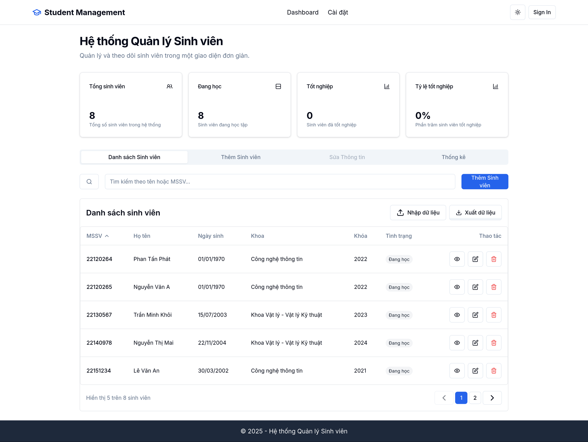

2. **Thêm sinh viên mới**

   - Nhấp vào nút "Thêm sinh viên" phía trên bảng
   - Điền đầy đủ thông tin sinh viên vào biểu mẫu (các trường có dấu \* là bắt buộc)
   - Nhấp nút "Lưu" để hoàn tất
     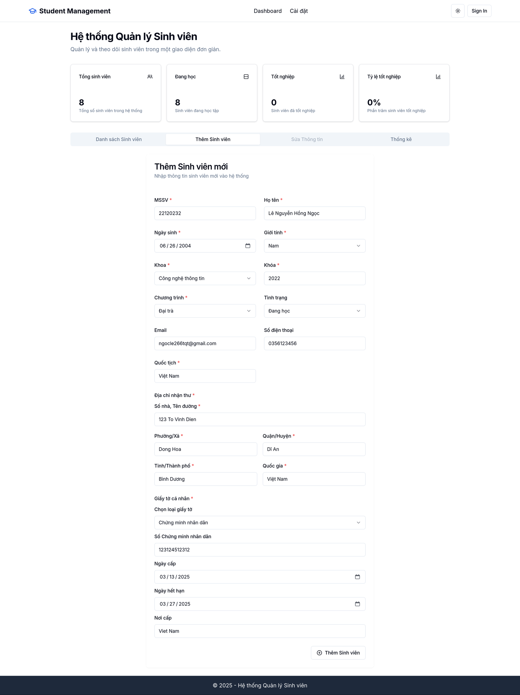

3. **Chỉnh sửa thông tin sinh viên**

   - Tìm sinh viên cần chỉnh sửa trong danh sách
   - Nhấp vào biểu tượng bút chì ở cột "Thao tác"
   - Thay đổi thông tin cần thiết trong biểu mẫu
   - Nhấp nút "Cập nhật" để hoàn tất
     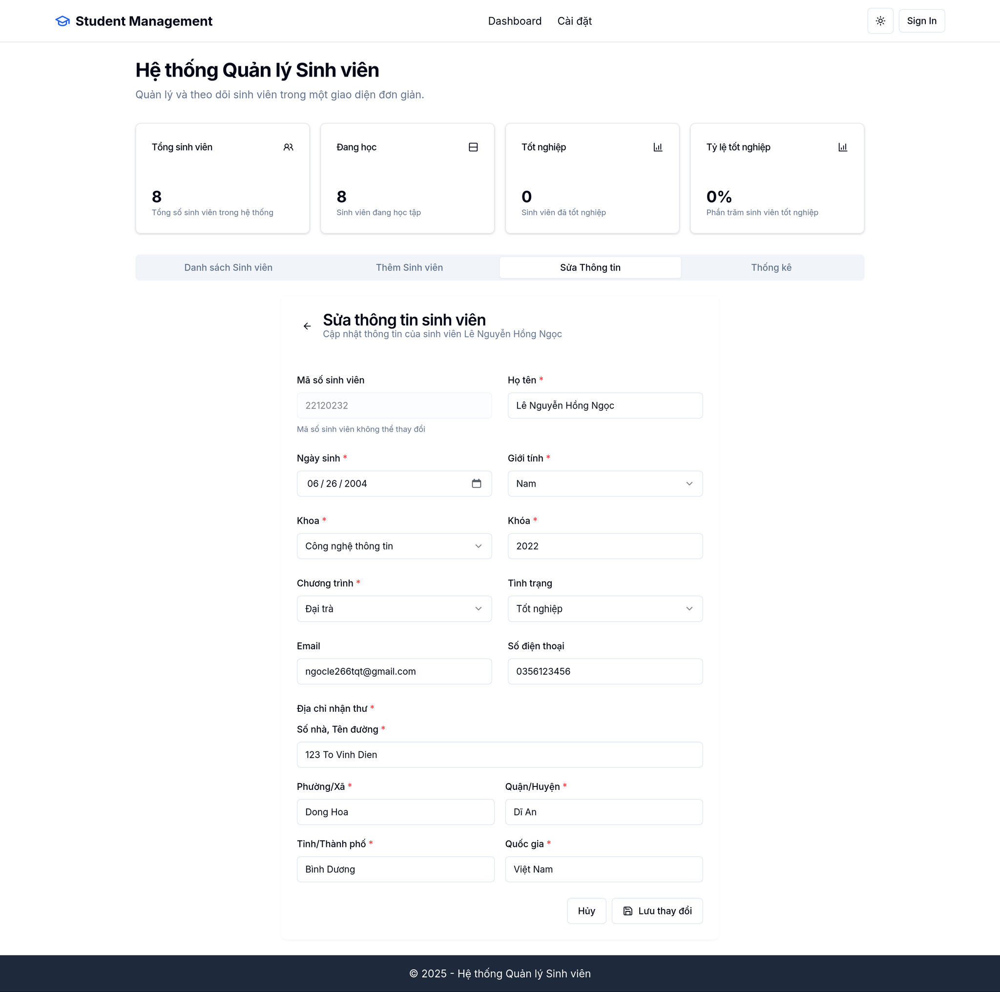

4. **Xóa sinh viên**

   - Tìm sinh viên cần xóa trong danh sách
   - Nhấp vào biểu tượng thùng rác ở cột "Thao tác"
   - Xác nhận xóa khi hộp thoại hiện lên
     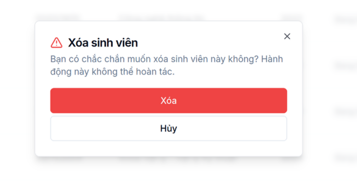

5. **Tìm kiếm sinh viên**
   - Tìm kiếm sinh viên bằng thanh tìm kiếm trên màn hình
   - Nhập mã số sinh viên hoặc tên sinh viên để tìm kiếm
     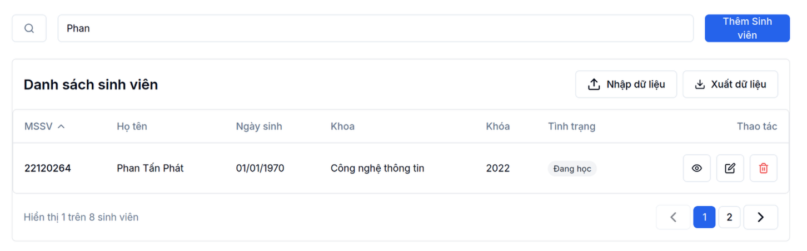

#### Quản lý khoa

1. **Xem danh sách khoa**

   - Vào mục "Cài đặt"
   - Chọn tab "Khoa"
   - Danh sách khoa sẽ hiển thị trong bảng
     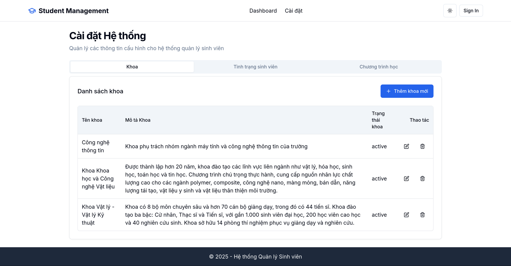

2. **Thêm khoa mới**

   - Vào mục "Cài đặt"
   - Chọn tab "Khoa"
   - Nhấp vào nút "Thêm khoa mới" phía trên bảng
   - Điền đầy đủ thông tin khoa vào biểu mẫu
   - Nhấp nút "Lưu" để hoàn tất
     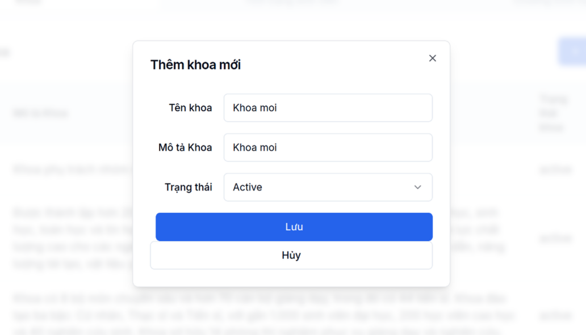

3. **Chỉnh sửa thông tin khoa**

   - Vào mục "Cài đặt"
   - Chọn tab "Khoa"
   - Tìm khoa cần chỉnh sửa trong danh sách
   - Nhấp vào biểu tượng bút chì ở cột "Thao tác"
   - Thay đổi thông tin cần thiết trong biểu mẫu
   - Nhấp nút "Cập nhật" để hoàn tất
     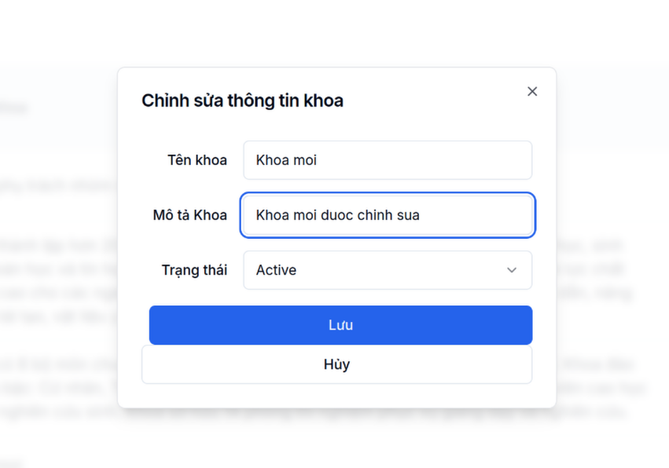

4. **Xóa khoa**

   - Vào mục "Cài đặt"
   - Chọn tab "Khoa"
   - Tìm khoa cần xóa trong danh sách
   - Nhấp vào biểu tượng thùng rác ở cột "Thao tác"
   - Xác nhận xóa khi hộp thoại hiện lên
     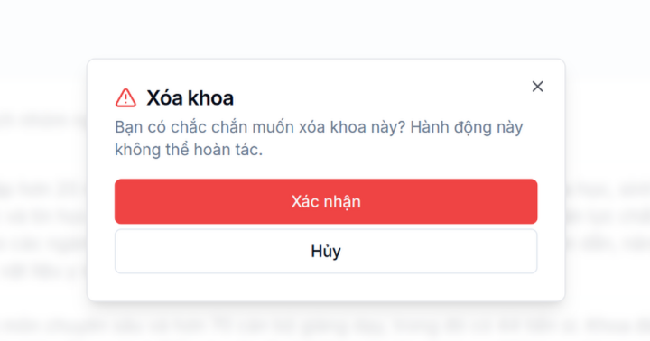
     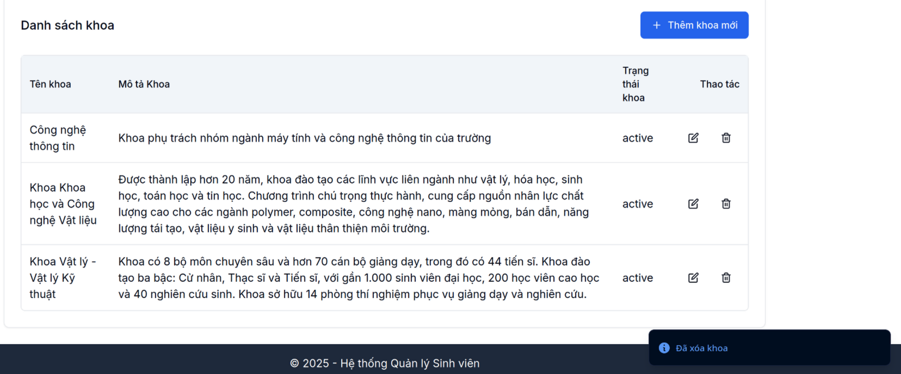

#### Quản lý chương trình học

1. **Xem danh sách chương trình học**

   - Vào mục "Cài đặt"
   - Chọn tab "Chương trình học"
   - Danh sách chương trình học sẽ hiển thị trong bảng
     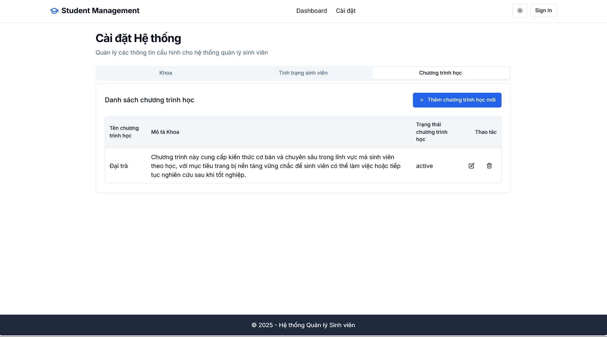

2. **Thêm chương trình học mới**

   - Vào mục "Cài đặt"
   - Chọn tab "Chương trình học"
   - Nhấp vào nút "Thêm chương trình học mới" phía trên bảng
   - Điền đầy đủ thông tin sinh viên vào biểu mẫu
   - Nhấp nút "Lưu" để hoàn tất
     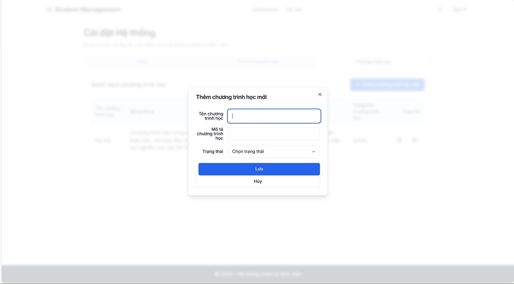

3. **Chỉnh sửa thông tin chương trình học**

   - Vào mục "Cài đặt"
   - Chọn tab "Chương trình học"
   - Tìm chương trình học cần chỉnh sửa trong danh sách
   - Nhấp vào biểu tượng bút chì ở cột "Thao tác"
   - Thay đổi thông tin cần thiết trong biểu mẫu
   - Nhấp nút "Cập nhật" để hoàn tất
     

4. **Xóa chương trình học**

   - Vào mục "Cài đặt"
   - Chọn tab "Chương trình học"
   - Tìm chương trình học cần xóa trong danh sách
   - Nhấp vào biểu tượng thùng rác ở cột "Thao tác"
   - Xác nhận xóa khi hộp thoại hiện lên
     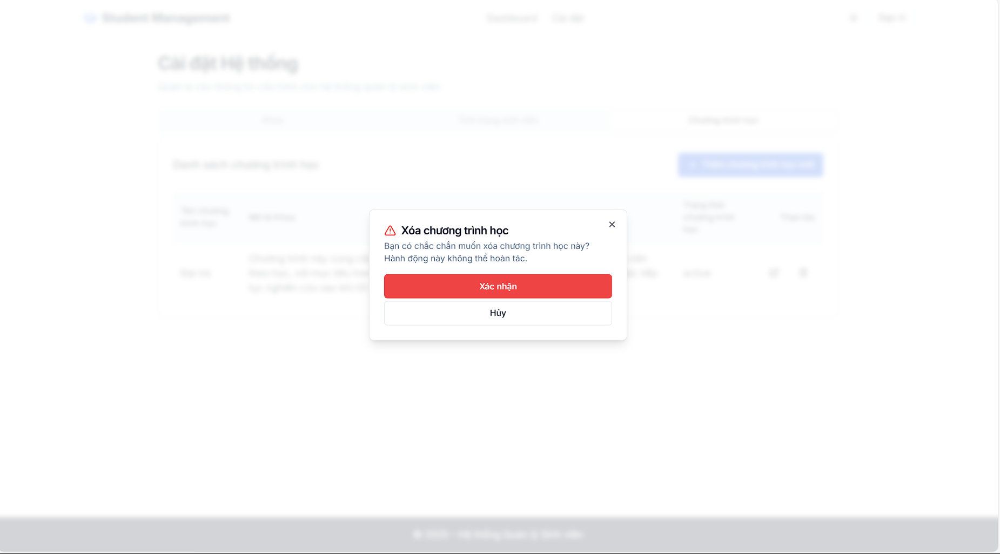
     

#### Quản lý trạng thái sinh viên

1. **Xem danh sách trạng thái sinh viên**

   - Vào mục "Cài đặt"
   - Chọn tab "Tình trạng sinh viên"
   - Danh sách trạng thái sinh viên sẽ hiển thị trong bảng
     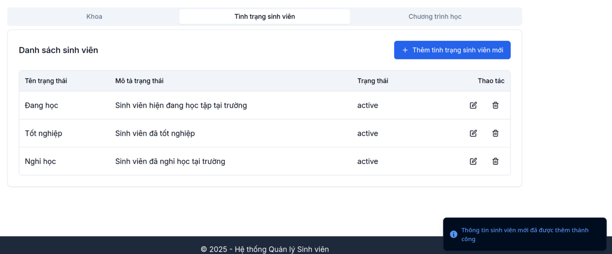

2. **Thêm trạng thái sinh viên mới**

   - Vào mục "Cài đặt"
   - Chọn tab "Tình trạng sinh viên"
   - Nhấp vào nút "Thêm tình trạng sinh viên mới" phía trên bảng
   - Điền đầy đủ thông tin sinh viên vào biểu mẫu
   - Nhấp nút "Lưu" để hoàn tất
     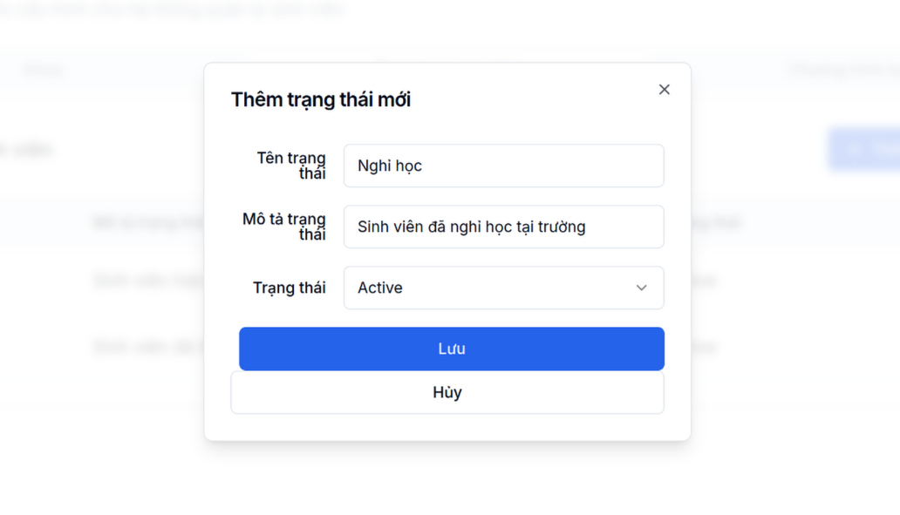

3. **Chỉnh sửa trạng thái sinh viên**

   - Vào mục "Cài đặt"
   - Chọn tab "Tình trạng sinh viên"
   - Tìm tình trạng sinh viên cần chỉnh sửa trong danh sách
   - Nhấp vào biểu tượng bút chì ở cột "Thao tác"
   - Thay đổi thông tin cần thiết trong biểu mẫu
   - Nhấp nút "Cập nhật" để hoàn tất
     

4. **Xóa trạng thái sinh viên**

   - Vào mục "Cài đặt"
   - Chọn tab "Tình trạng sinh viên"
   - Tìm tình trạng sinh viên cần xóa trong danh sách
   - Nhấp vào biểu tượng thùng rác ở cột "Thao tác"
   - Xác nhận xóa khi hộp thoại hiện lên
     

#### Import và export dữ liệu

- Cho phép import/ export dữ liệu danh sách sinh viên dễ dàng, nhanh chóng
- Hỗ trợ JSON và XLSX

##### File mẫu cho import/export dữ liệu

- **File JSON mẫu**:  
   Định dạng JSON cho import/export dữ liệu sinh viên.  
   [Tải file JSON mẫu](./export-import/test.json)

- **File XLSX mẫu**:  
   Định dạng Excel (XLSX) cho import/export dữ liệu sinh viên.  
   [Tải file XLSX mẫu](./export-import/test.xlsx)

#### Cơ chế logging để kiểm tra hoạt động của server trên local và production

- Cho phép hiển thị các hoạt động diễn ra trong server thông qua console
- Cho phép lưu trữ các hoạt động diễn ra trong server vào file log
- Cơ chế dọn dẹp file log bằng giới hạn số ngày log lưu trữ
  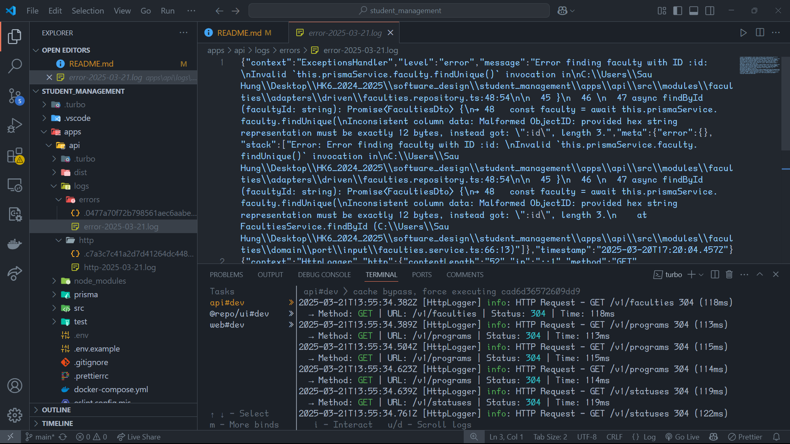
  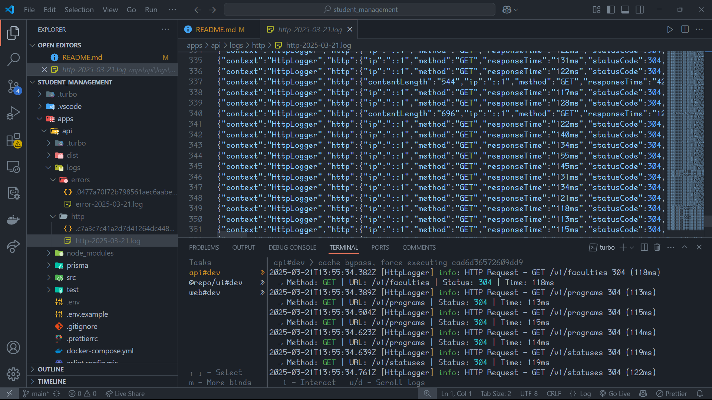

#### Cơ chế thống kê

- Cho phép hiển thị thống kê của sinh viên phân bố theo trạng thái
- Cho phép hiển thị thống kê của sinh viên phân bố theo khoa
- Cho phéo hiển thị thống kê của sinh viên đang theo học, tốt nghiệp, tỷ lệ tốt nghiệp và tổng số sinh viên
  
  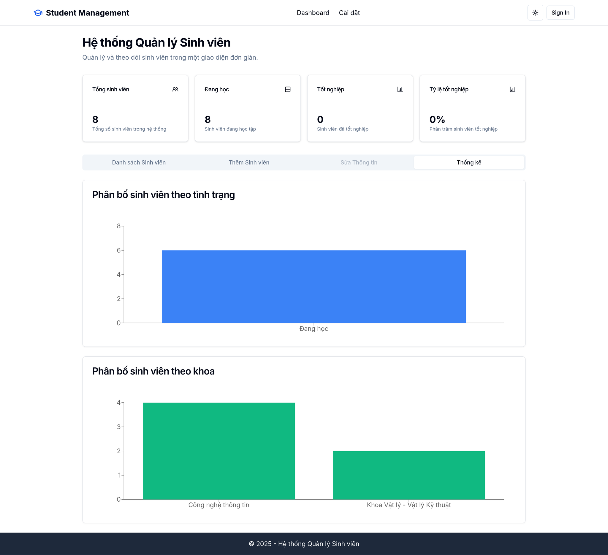

#### Kiểm thử ứng dụng (Unit Test)

- Vào folder api của backend 'cd apps/api'
- Chạy lệnh 'pnpm test'
- Kết quả khi chạy unit-test
  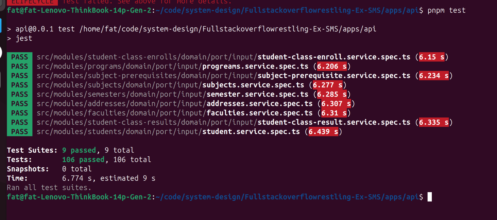

#### Danh sách Môn học

- Hình ảnh danh sách môn học bao gồm các action của từng môn học và bộ lọc filter
  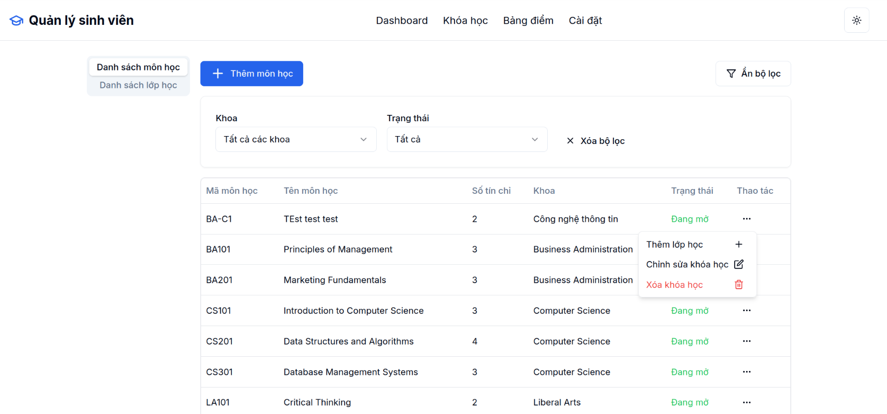

- Giao diện thêm lớp học

  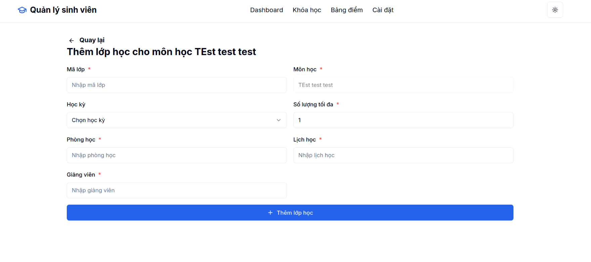

- Chỉnh sửa lớp học

  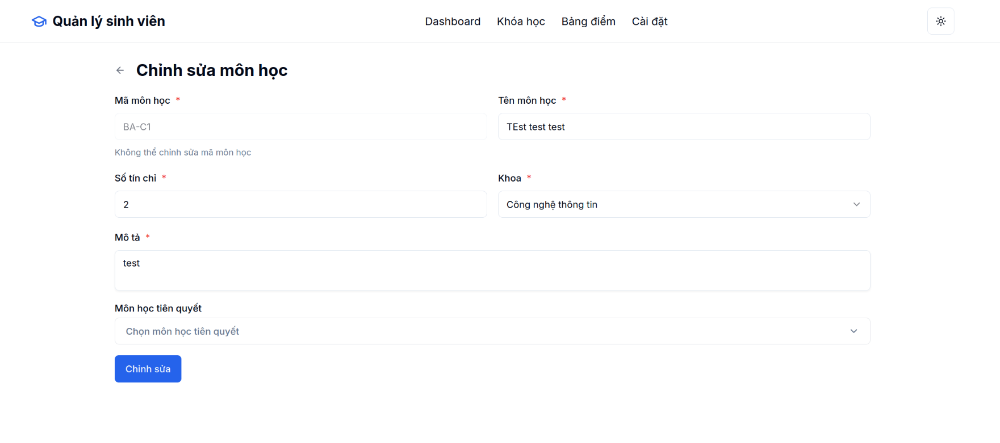

#### Danh sách Bảng điểm

- Hình ảnh danh sách bảng điểm và filter, action

  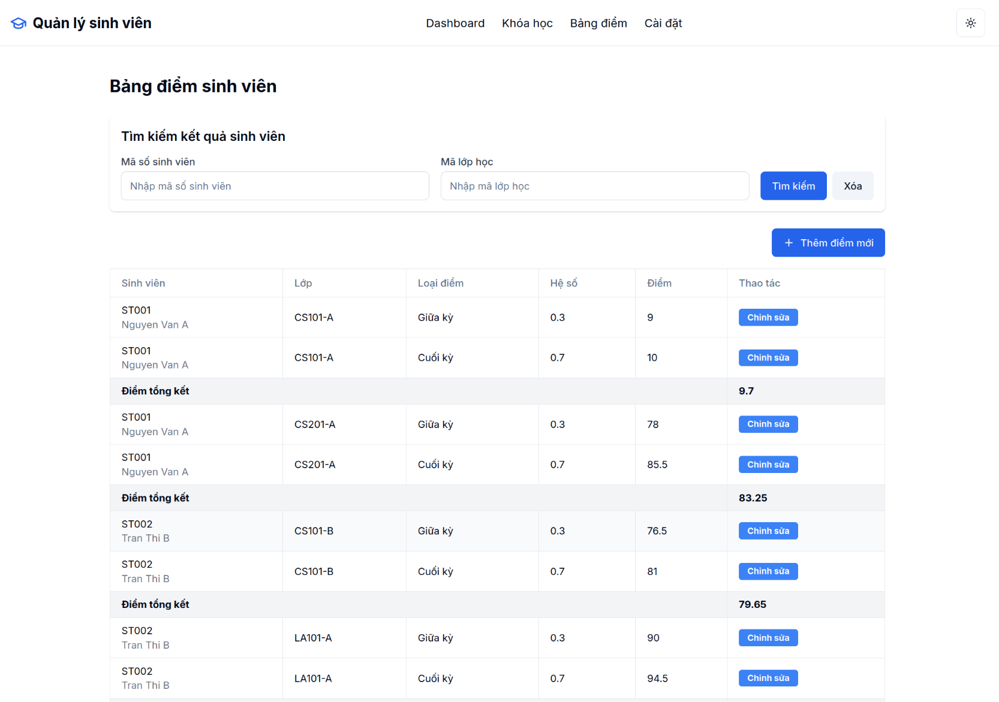

- Thêm điểm mới:

  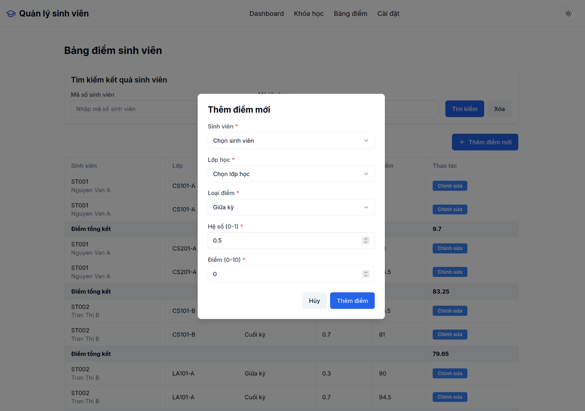

- Cập nhật điểm:

  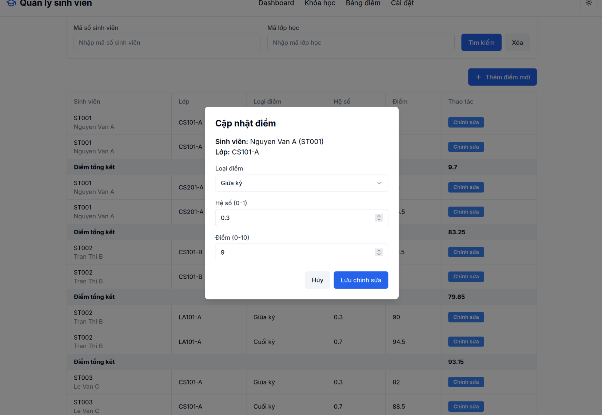

### Xử lý sự cố

1. **Lỗi khi cài đặt dependencies**

   - Xóa thư mục node_modules và file pnpm-lock.yaml:
     ```
     rm -rf node_modules
     rm pnpm-lock.yaml
     ```
   - Chạy lại lệnh cài đặt:
     ```
     pnpm install
     ```

2. **Lỗi "Port already in use" (Cổng đã được sử dụng)**

   - Kết thúc tiến trình đang sử dụng cổng đó:
     - Windows:
       ```
       netstat -ano | findstr :3000
       taskkill /PID <PID> /F
       ```
     - macOS/Linux:
       ```
       lsof -i :3000
       kill -9 <PID>
       ```
   - Hoặc thay đổi cổng trong file cấu hình

3. **Ứng dụng không phản hồi**

   - Làm mới trang web (F5)
   - Kiểm tra xem cả hai server (API và Web) đều đang chạy
   - Khởi động lại ứng dụng:
     ```
     pnpm start --reset-cache
     ```

4. **Lỗi TypeScript**
   - Kiểm tra các lỗi TypeScript:
     ```
     pnpm type-check
     ```
   - Sửa các lỗi được báo cáo trong mã nguồn

### Cách phát triển và đóng góp vào dự án

#### Cấu trúc monorepo

Dự án sử dụng kiến trúc monorepo với Turborepo, cho phép quản lý nhiều package và ứng dụng trong một repository:

- **apps/web**: Ứng dụng frontend (Next.js)
- **apps/api**: API server (NestJS)
- **packages/ui**: Thư viện UI components dùng chung
- **packages/database**: Module xử lý kết nối và truy vấn database

#### Quy trình phát triển

1. **Tạo nhánh mới**:

   ```
   git checkout -b feature/ten-tinh-nang
   ```

2. **Chạy trong chế độ phát triển**:

   ```
   pnpm dev
   ```

3. **Kiểm tra code**:

   ```
   pnpm lint
   pnpm test
   ```

4. **Tạo pull request** khi hoàn thành tính năng

### Câu hỏi thường gặp (FAQ)

**Q: Làm cách nào để thay đổi cổng mặc định của ứng dụng?**
A: Chỉnh sửa biến môi trường trong file `.env` tại thư mục gốc hoặc trong thư mục của ứng dụng tương ứng.

**Q: Tôi có thể sử dụng npm thay vì pnpm được không?**
A: Không khuyến khích vì dự án được cấu hình tối ưu cho pnpm và Turborepo. Sử dụng npm có thể gây ra các vấn đề về tương thích.

**Q: Làm thế nào để thêm một package mới vào monorepo?**
A: Sử dụng lệnh sau để tạo package mới:

```
pnpm turbo gen
```

Sau đó làm theo các hướng dẫn trên màn hình.

**Q: Làm thế nào để cài đặt thư viện mới cho một ứng dụng cụ thể?**
A: Sử dụng lệnh:

```
pnpm --filter <app-name> add <package-name>
```

Ví dụ: `pnpm --filter web add react-router-dom`
